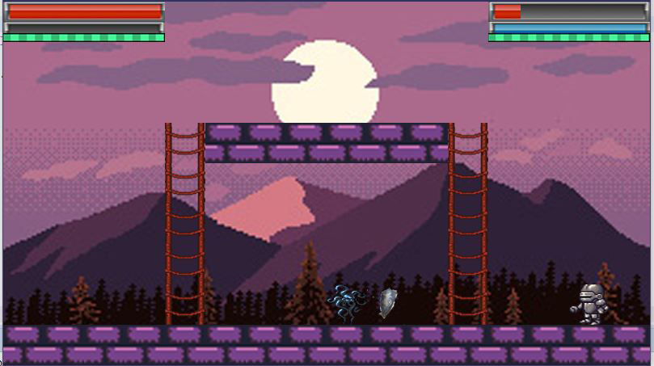

# ¡A jugar! 

### Nombre del Juego : Inferious

## Juego realizado con la biblioteca Wollok Game

### Resumen:

En este juego se puede elegir entre 4 diferentes escenarios para pelear. Y tambien entre 4 diferentes personajes.
Cada personaje puede atacar a su rival con su ataque normal y tambien puede usar su poder especial.
Los ataques normales reducen la estamina, que es la resistencia de cada jugador, haciendo que no se puedan realizar infinitos golpes pero cada un cierto intervalo de tiempo se vuelve a generar la estamina.
Los ataques con poderes reducen la energia, donde la unica forma de recuperarla es consumiendo pociones.
Los jugadores que esten debilitados pueden recuperar su vida consumiendo manzanas.
La espada es un item de ataque el cual se puede atacar con el mismo 3 veces, si se tiene equipado causa mayo impacto con cada ataque normal.
El escudo protege al personaje dandole 20 puntos extra de vida, al consumirse el escudo  este se pierde.
Los escenarios tienen escaleras las cuales nos permiten treparlas y ganar altura en las distintas plataformas, para obtener una ventaja de posicion contra el rival.
Tanto los items de defensa y ataque, como los healers aparecen de forma aleatoria cada 20 segundos, si un item no lo tomo nadie desaparece y aparece otro item en otro lugar.

### Instrucciones:

- Para saltar la pantalla de inicio tocar cualquier tecla.
- Para saltar la pantalla de instrucciones tocar la tecla espacio
- En la pantalla de seleccion de escenario se mueve el cursor con las teclas WASD y se elije con la tecla ENTER.
- En la pantalla de seleccion de personaje se selecciona el personaje que se utilizara. No se puede elegir el mismo personaje.
- Jugar!
- Para terminar el juego una vez que sale la pantalla de game over tocar cualquier tecla

### Acerca de:

Autores:

- Aspres Santiago
- Chejolan Santiago
- Baldracchi Tobias

Docente/Curso/Institución:

- Alfredo Sanzo y Nahuel Palumbo
- Curso K2004
- UTNFRBA

Versión de wollok: 

Fecha: 17/11/2019

[Guía de herramientas](https://www.wollok.org/documentacion/conceptos/)

